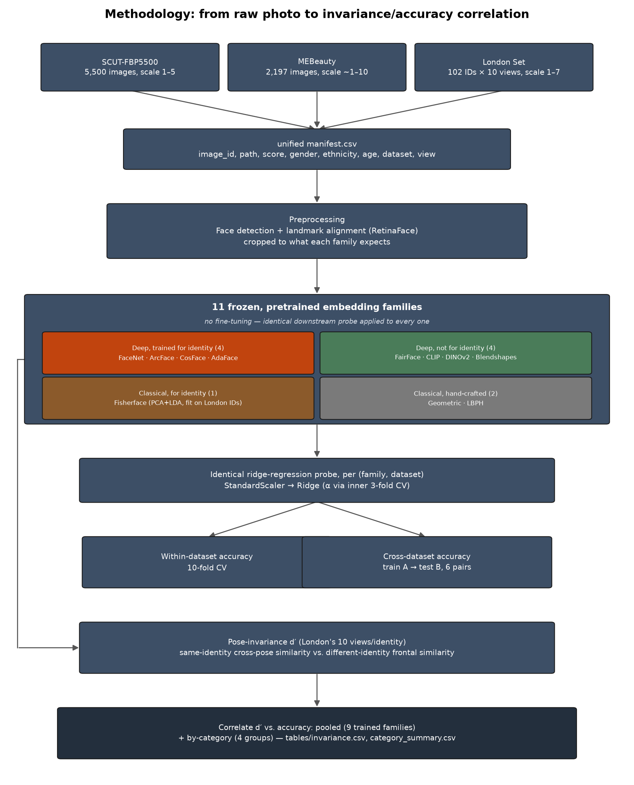
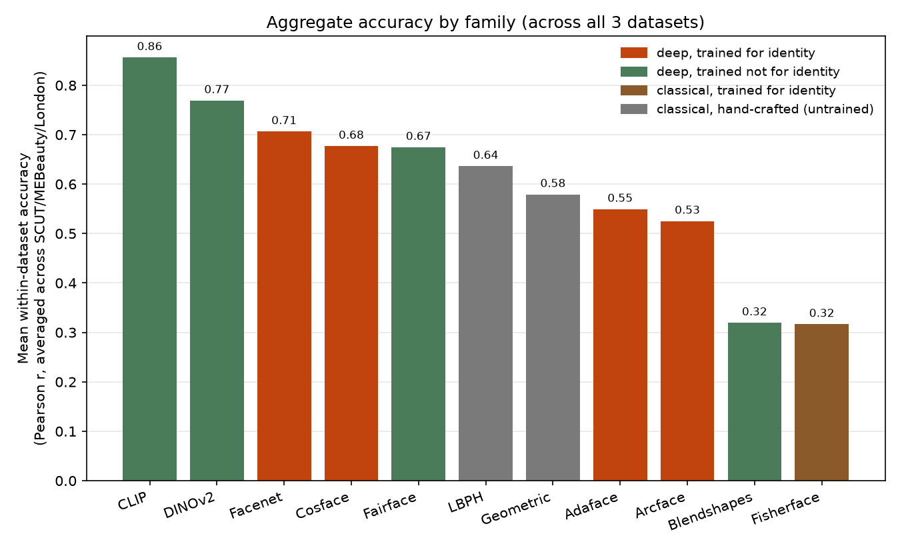
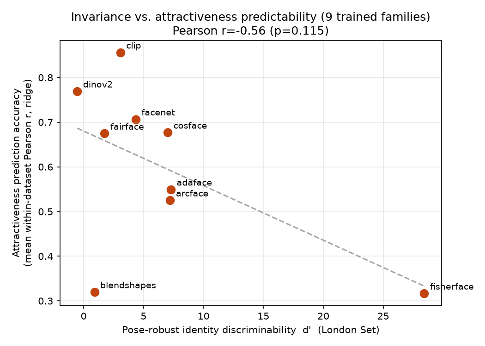

# Do Face-Recognition Embeddings Differ in How Well They Predict Attractiveness?

*A fun passion project about how good AI was at predicting attractiveness. Just a random unserious rabbit hole.*

Face-recognition models are trained to be pose-invariant — a photo of you from the side
should produce basically the same embedding as one from the front. To pull that off, the
model has to throw away appearance information it doesn't need for telling people apart.
I wanted to know if that thrown-away information includes stuff that matters for judging
how attractive a face looks, since that's a pretty different task than "is this the same
person."

So I ran the experiment. 11 different face-embedding families (deep identity CNNs, a
couple of classical non-deep methods, plus general-purpose foundation models like CLIP
and DINOv2), tested against 3 datasets of human attractiveness ratings (SCUT-FBP5500,
MEBeauty, the Face Research Lab London Set). Same frozen embedding into the same ridge
regression probe every time, so the only thing that changes is what the embedding
captured, not how good the downstream model is.



## What I found



- **Yes, there's a tradeoff, and it shows up cleanest as a category effect.** Group the
  families into deep vs. classical, and identity-trained vs. not — in both cases, the
  identity-trained version loses to its non-identity counterpart.
- **CLIP wins, and it's not because of the text supervision.** CLIP is best on every
  dataset. DINOv2 is a close second despite having zero labels, zero text, and zero
  identity signal during training. What they have in common is just that neither was ever
  told to discard appearance.
- **Fisherface and Blendshapes are both terrible, for opposite reasons.** Fisherface is a
  classical method explicitly built to maximize identity separation, and it pays for that
  hard. Blendshapes never optimized for identity at all, but it's only 52 numbers, so
  there's not enough room left over to encode appearance either.
- **A 2006 texture-histogram method (LBPH) beats ArcFace and AdaFace.** No neural network,
  no learned weights, and it still does better than two "modern" face-recognition CNNs at
  this. It really does come down to what the model was trained to throw away, not how
  fancy it is.



- **Demographic accuracy gaps show up everywhere, but they don't trade off against
  overall accuracy.** On MEBeauty, Black faces get the lowest accuracy in 8 of 11
  families. The families that are best overall (CLIP, FaceNet, DINOv2) also have the
  smallest gaps between groups — so being accurate and being consistent across groups
  aren't in tension here, at least not in this data.


## Running it yourself

```
python src/build_manifest.py            # unified manifest.csv
python src/preprocess.py                # detect+align -> data/aligned112, data/crops224
./run_extract_all.sh                    # 11 families x 3 datasets -> embeddings/*.npz
./run_analysis.sh                       # ridge probe, invariance -> tables/
python src/figures.py                   # summary figures -> figures/*.png
python src/flowchart.py                 # pipeline diagram -> figures/methodology_flowchart.png
```

`tables/` has the raw numbers (per-family, per-dataset accuracy, invariance scores,
demographic gaps) if you want to dig past the headline figures above.

---

This was just a fun little side project done out of curiosity, not intended for
publications or formal research programs. Not peer reviewed :p
