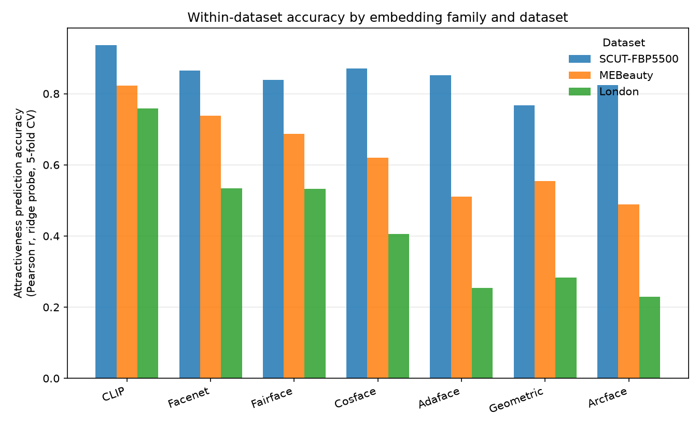
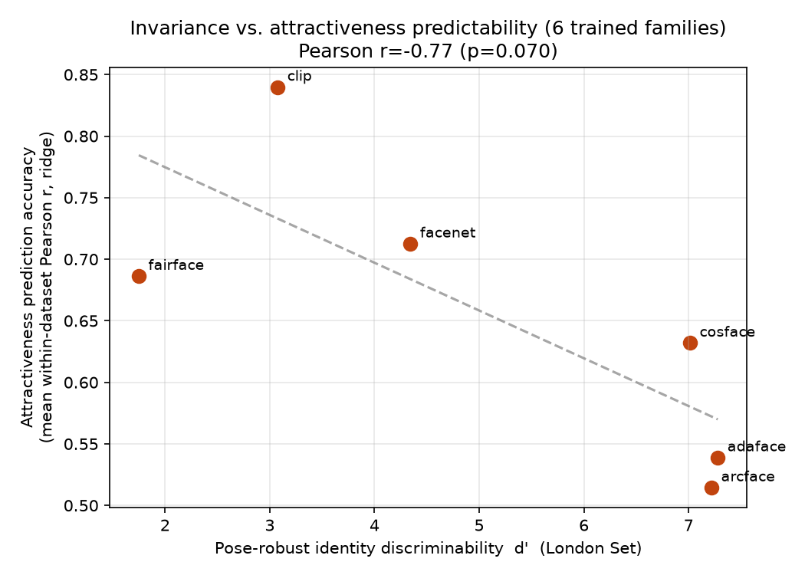
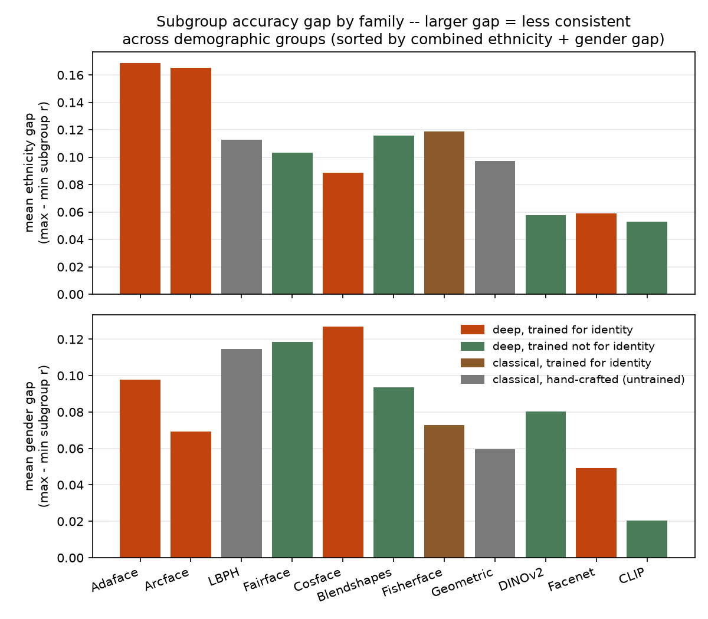
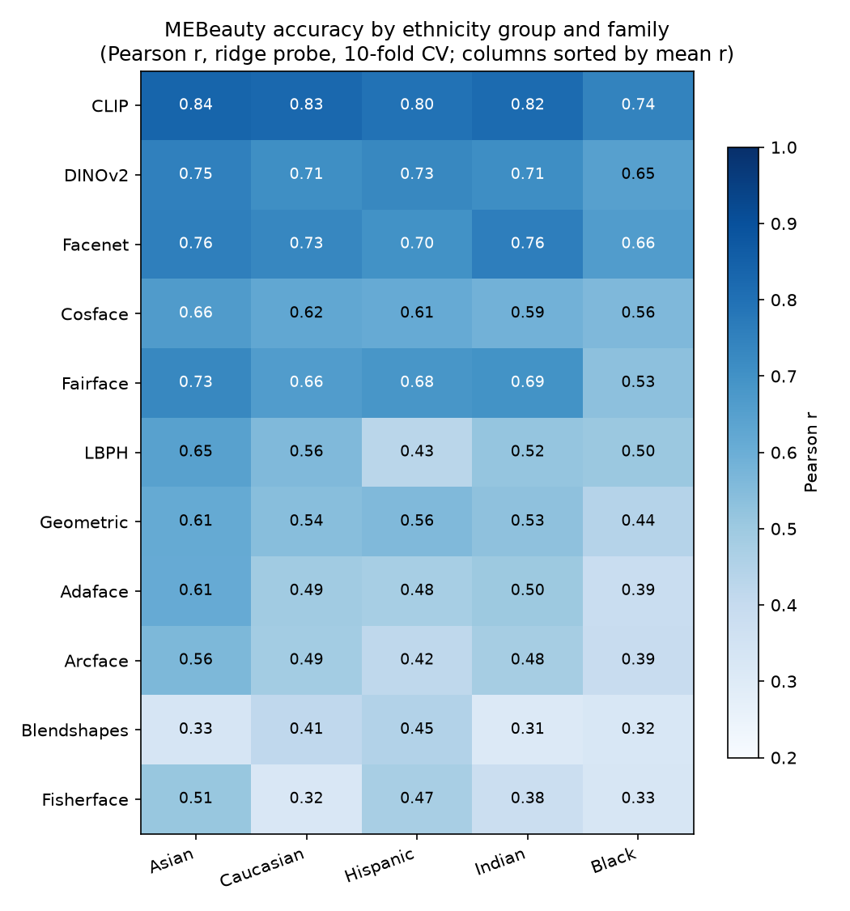
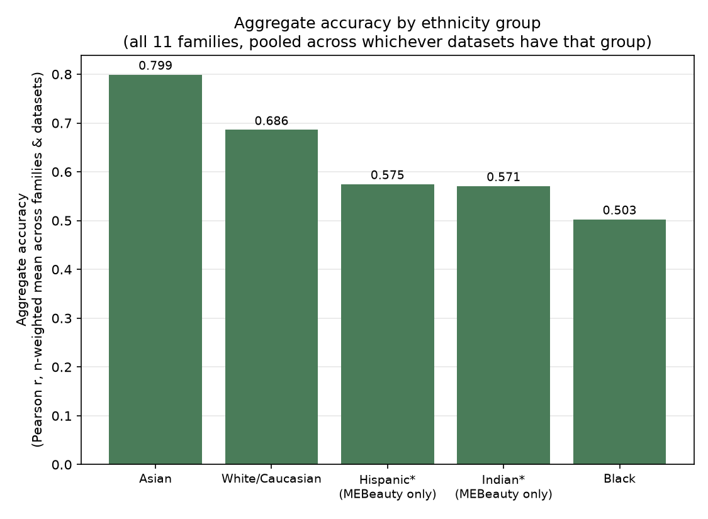

# Do Face-Recognition Embeddings Differ in How Well They Predict Attractiveness?

*Brief report. Full method, all tables, and every caveat live in `RESULTS.md` at the
repo root — this is the condensed version.*

## Question

Face-recognition models are trained to be **pose-invariant**: two photos of the same
person, from different angles, should produce nearly identical embeddings. That
invariance is bought by *discarding* whatever appearance information isn't needed to
tell people apart. Does that tradeoff show up in a completely different task — predicting
how attractive a face looks? We tested 11 embedding families, spanning deep
identity-margin CNNs, foundation models, and two classical (non-deep) methods, against 3
human-rated attractiveness datasets (SCUT-FBP5500, MEBeauty, the Face Research Lab
London Set). We also ask a second question of the same predictions: is each family's
accuracy *consistent across demographic subgroups* (gender, ethnicity, and — where
ground-truth age exists — age), independent of the invariance story above.

## Method, in brief

Every embedding is frozen (no fine-tuning) and scored with the *same* simple ridge
regression probe (10-fold CV within each dataset), so differences in accuracy reflect
what each embedding encodes, not how well-tuned its predictor is. **Pose-robust identity
discriminability (d′)** is measured only on the London Set's 10-views-per-identity
photos, using a signal-detection framing borrowed from face-verification research. We
then ask whether a family's d′ predicts its attractiveness accuracy.

## Findings

**1. The tradeoff shows up most reliably as a category effect, not a single correlation
number.** Grouping the 9 trained families into (deep vs. classical) × (trained for
identity vs. not): in *both* mechanisms, the identity-trained variant underperforms its
own non-identity-trained counterpart (deep: 0.61 vs. 0.66 mean accuracy; classical: 0.32
vs. 0.61). The pooled d′-vs-accuracy correlation is real but fragile — it swings from
r=−0.68 to r=−0.11 to r=−0.56 depending on exactly which families are included, because
one family (Fisherface) is a high-leverage outlier. The categorical comparison doesn't
have that problem.

**2. Foundation models win, and it's not about text.** CLIP (image-text contrastive) is
the best predictor on every dataset. DINOv2 — self-supervised, no text, no labels, no
identity signal at all — is a close second, beating every dedicated face-recognition
model. Sharing "never trained to discard appearance" matters more than either model's
specific training signal.

**3. Fisherface and Blendshapes are effectively tied for the worst predictor — for
opposite reasons.** Fisherface (a classical linear discriminant, no neural network at
all, explicitly fit to maximize identity separation) and MediaPipe's Blendshapes (a
52-value expression descriptor that was never trained for identity at all) land within
0.003 of each other at the bottom of the ranking. Fisherface confirms the tradeoff
directly — maximize identity separation, by any mechanism, and accuracy craters — with
one asterisk: its d′ was fit on the same data it's measured on, not zero-shot like every
other family. Blendshapes shows the flip side: low pose-discriminability alone isn't
enough if the representation is too low-dimensional to carry appearance information in
the first place.

**4. A classical, non-deep method (LBPH) beats several deep face-recognition CNNs.**
Zero learned parameters, 2006-vintage texture histograms, and it still outperforms
ArcFace and AdaFace on this task — direct evidence that what matters is the training
*objective*, not model sophistication.

**5. Demographic gaps exist in every family — and they track *with* accuracy, not
against it.** On MEBeauty, Black subgroup accuracy is the lowest of 5 ethnicity groups
in 8 of 11 families, and female accuracy beats male in all 11 (but not on SCUT or
London, so the gender effect looks dataset-specific rather than universal). The most
accurate families overall (CLIP, FaceNet, DINOv2) also have the smallest demographic
gaps — being good at this task and being consistent across groups aren't in tension here.
Age could only be checked on the London Set (the other two datasets have no age label at
all), on much smaller subgroups, so its larger apparent gap is at least partly a
small-sample effect, not necessarily a bigger true disparity.

## Limitations (see `RESULTS.md` for full detail)

- Identity backbones differ in training data as well as loss, so family comparisons
  can't fully isolate the loss function's contribution.
- The invariance probe uses one small, studio-posed dataset (London, n=102).
- Two families have data-quality caveats specific to how they were built: MediaPipe
  Blendshapes misses ~85% of true-profile poses; Fisherface's d′ is not zero-shot.
- Age bias analysis is London-only (no ground-truth age in SCUT/MEBeauty) and therefore
  noisier than the gender/ethnicity analysis; ethnicity group definitions and counts
  differ by dataset, so gaps are only compared within a dataset, never across datasets.

## Bottom line

Embeddings trained to discard appearance in favor of pose-invariant identity — whether
by a deep CNN or a classical linear discriminant — are worse at predicting
attractiveness than embeddings that were never asked to make that tradeoff. The effect
is real and shows up in two independent modeling paradigms, but a single pooled
correlation number overstates how clean it is; the category-level comparison is the more
trustworthy read. Separately, every family shows some demographic accuracy gap, most
consistently a Black-subgroup disadvantage on MEBeauty — but the gap shrinks, rather
than grows, for the families that are most accurate overall, so this study finds no
accuracy/fairness tradeoff here, only a shared "which embedding is best" answer to both
questions.
